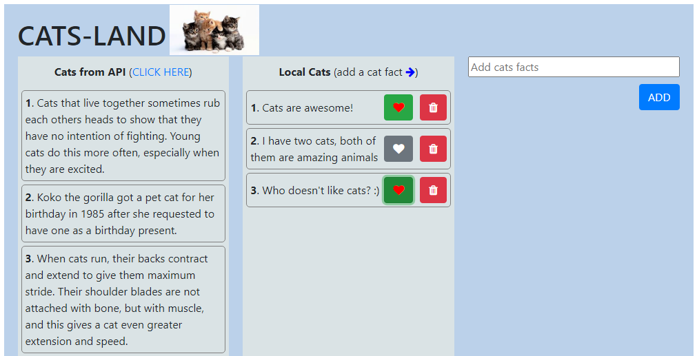

## Cats Land React App with Redux (state management JS Library)

This app was built with React v17.0.1

## API for all cat facts

[https://cat-fact.herokuapp.com/facts/random?animal_type=cat&amount=10](https://cat-fact.herokuapp.com/facts/random?animal_type=cat&amount=10)

It only grabs 10 cat facts, change the number at the end to get more cat facts.

## Deployment

This React App has been deployed to Heroku.

[Click here](https://cats-land-react-redux-app.herokuapp.com/) to see the UI output in Heroku.
